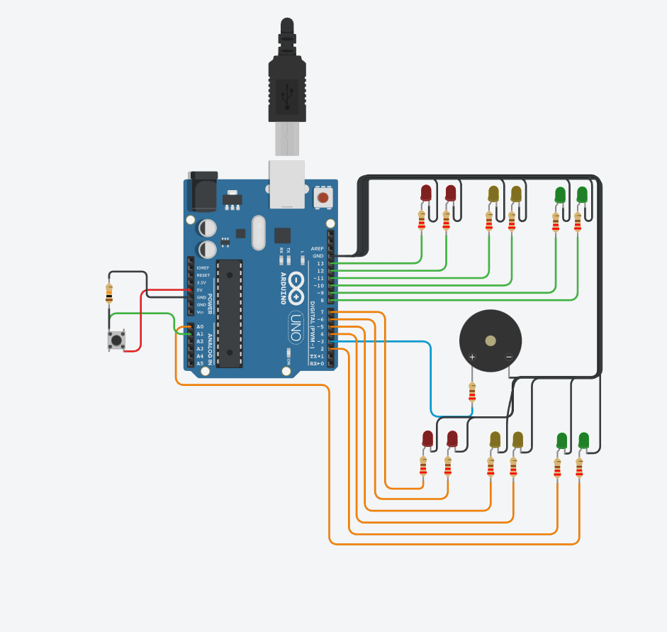

# SPD_Dojo_1
# Ejemplo Documentación Dojos

## Integrantes 
- Franco Ferrari 
- Diego Leonard Gloria Salas
- Adrian Filippelli
- Quimey Alejo Fontan

## Proyecto: Contador binario.

## Descripción
El proyecto consta de una serie de semaforos funcionales con su propio sistema de tiempo junto con su feedback sonoro (buzzer) funcional y con un pulsador encargado de extender los tiempos de duracion de cruze para peatones.

## Función principal
Esta funcion se encarga de encender y apagar los leds.

B0, B1, B2, B3 son #define que utilizamos para agregar los leds, asociandolo a pines de la placa arduino.

(Breve explicación de la función)

~~~ C++ 
void prender(int led_prender,int led_prender2,int demora_prender)
{
  digitalWrite(led_prender, HIGH);
  digitalWrite(led_prender2, HIGH);
  delay(demora_prender);
}

void apagar(int led_apagar,int led_apagar2)
{
  digitalWrite(led_apagar, LOW);
  digitalWrite(led_apagar2, LOW);
}
~~~

## :robot: Link al proyecto
- [proyecto](https://www.tinkercad.com/things/aOYiibnDjWu)
## :tv: Link al video del proceso
- [video](https://www.youtube.com/watch?v=VyGjE8kx-O0)

---
### Fuentes
- [Consejos para documentar](https://www.sohamkamani.com/how-to-write-good-documentation/#architecture-documentation).

- [Lenguaje Markdown](https://markdown.es/sintaxis-markdown/#linkauto).

- [Markdown Cheatsheet](https://github.com/adam-p/markdown-here/wiki/Markdown-Cheatsheet).

- [Tutorial](https://www.youtube.com/watch?v=oxaH9CFpeEE).

- [Emojis](https://gist.github.com/rxaviers/7360908).

---